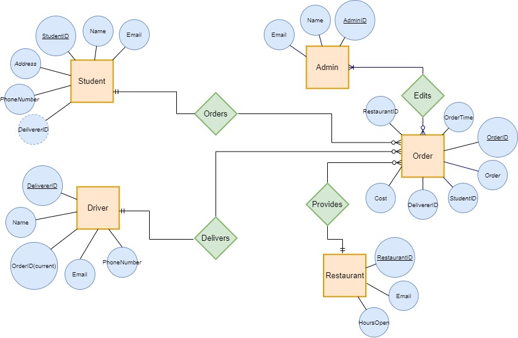

# CampusChow
This is a model for a campus-wide food delivery system with a SQL database.
# Description
This project will house a database system to handle deliveries within a college campus. The system will ensure that the primary actors are affiliated with the university. The database will use MySQL for all management purposes.
# Use Case
* Student: As a student, I need to be able to place orders from the places I want food from, and I want to see the status of my orders, and cancel orders if time permits. 
* Admin: As an admin, I need to be able to view the orders placed, view the status of the orders, and edit them as I see fit.
* Driver: As a Driver, I need to be able to view a students order, their address, and their contact information if necessary.
* Restaurant: As a restaurant, I want to be able to sign up with the campus delivery app, and post/edit my hours for delivery. 
# Business Rules
* Only Students, Admins, and Deliverers can log in to participate with campus delivery services.
* Any of the three will able to order or deliver, but you will need to use an ID to participate in the transactions.
* In order to sign up (Student/Admin/Driver), you must include a university email, and be authenticated through the portal (like UNCC canvas authentication), and confirm your signup through your university email.
* All authentication (other than restaurants) will be handled through the universities portal, because the users are all within the universities scope. University emails will be stored to handle the authentication with the portal.
* Students can order from any restaurant within a 5 mile radius of the campus.
# EERD
This system will comprise of 5 tables: A student, order, driver, admin, and restaurant. After a student confirms their order, a driver will pickup the order, an admin can view and edit the order, and all restaurants signed up with the app will be able to edit their hours.
 
# Trigger
The trigger for this system is when an order is deleted from the order table. This could have been caused by several circumstances (admin deleting order, student canceling order, or a driver verifying the order as complete). 

When this trigger occurs, the driver responsible for the order will have their current orderID removed from their record in the driver table, because the order is no longer necessary. 
[Click here to view the Trigger](Trigger/driverVerifiedOrderTrigger.sql) 
# Stored Procedure
addOrder: add an order to the order table 
(StoredProcedures/addOrderProcedure.png) 
cancelOrder: delete an order from the order table 
(StoredProcedures/cancelOrderProcedure.png) 
selectOrders: display all orders from a particular restaurant 
(StoredProcedures/selectOrdersProcedure.png) 
[Click here to view the Stored Procedures](StoredProcedures) 
# Description of Future Work:
We will add a semi-functional UI to demonstrate the connection of the database to the app (CRUD capabilities and a view of the changes made).
# SQL Dump
[Click here to view the SQL Dump](campusChow.sql) 
